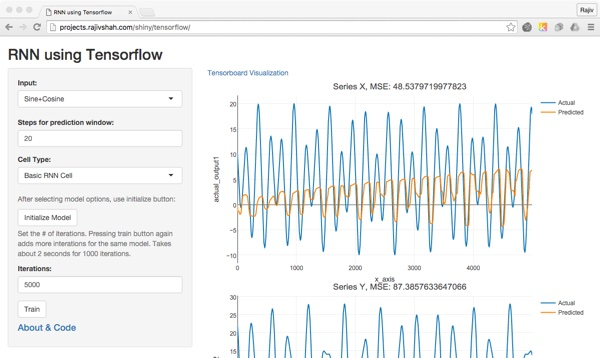

### **Shiny front end for Tensorflow demo**

This repo shows how shiny can be a GUI front end for tensorflow. The shiny app allows trying different inputs, RNN cell types, and even optimizers. The results are shown with plots as well as a link to tensorboard. The app allows anyone to try out these models with a variety of modelling options.

The code for the shiny web app was based around work by [Sachin Jogleka](https://codesachin.wordpress.com/2016/01/23/predicting-trigonometric-waves-few-steps-ahead-with-lstms-in-tensorflow/). Sachin focused on RNNs that had two numeric inputs.  (This is slightly different than most RNN examples which focus on language models.)

Sachin’s code was modified to allow different cell types and reworked so it could be called from rPython. The shiny web app relies on rPython to run the tensorflow models.  There is also an iPython notebook in the repository if you would like to test this outside of shiny.

 

#### Live Demo:

I have a [live demo of this app](http://projects.rajivshah.com/shiny/tensorflow/), but it's flaky.  Building RNN models is computationally intensive and the shiny front end is intended to be used on development boxes with tensorflow.  My live demo app is limited in several ways. First, the server lacks the horsepower to build models quickly.  Second, if the instructions below are not carefully followed the app will crash.  Third, its not designed for multiple people building different types of models at the same time. Finally, tensorboard application sometimes stops running, so the link to tensoboard within the app will not work.  So please, run the app locally.

The requirements for the app include tensorflow on the Python side.  Shiny, Metrics, plotly, and rPython on the R side. rPython can be difficult to install/configure, so please verify that rPython is working correctly if you are having problems running the code.

To use the app, select your model options. For input, there are three options of increasing complexity. Steps for prediction window refers to how far ahead is the model supposeto predict. For this data, 20s seemed a reasonable window.  For Cell Type, select one of the cell types and press Initialize Model.  Then select iterations (max of 10,000) and press Train.  After a few seconds, you will see the output.  

Take advantage of the plots to zoom in and out and see the shape of the actual and predicted outputs. To further improve the model, you can add iterations by pressing the train button.

To try a new model, select a new cell type and then press initialize model.  Then select the iterations and press train.

If the app crashes, no worries, it happens.  I have not accounted for everything that could go wrong. 
